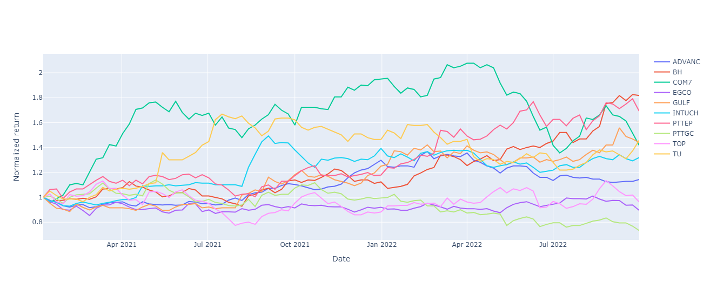
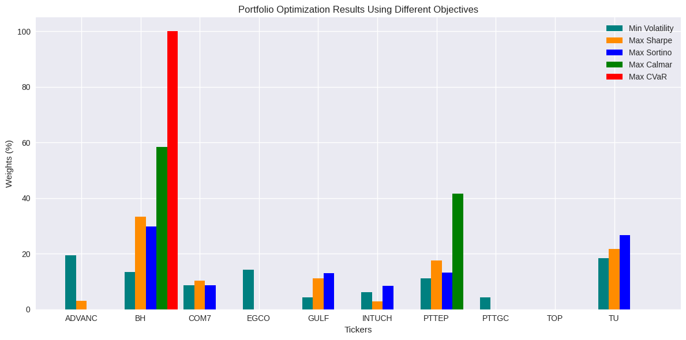

# Visualizing-Data-A-Journey-Through-Insights-with-Python-2
 This project is dedicated to the art and science of data visualization using Python. In a world driven by data, effective visualization is the bridge between raw information and actionable insights. Through this project, I aim to showcase how complex datasets can be transformed into compelling, interactive, and insightful visual stories.

 ## 📄 Guide
Download the PDF here: [Visualizing Data Guide](docs/docs/docs/Visualizing.pdf)

## 🗂️ Code Examples
### 1. **Normalized Trends Over Time** 
**When to use**: Compare trends of multiple variables (e.g., temperature, sales, user activity) by normalizing their starting values to 1.0.  
**Example**:  
- Track relative growth of product sales across regions.  
- Compare temperature fluctuations in different cities. 

```python
# import pandas pd
import plotly.graph_objects as go

# Function to normalize prices
def normalizedprice(df):
    """
    Normalizes the prices in a DataFrame so they all start at 1.0.
    This makes it easier to compare trends over time.
    """
    normalized_df = df / df.iloc[0]  # Divide each value by the first row's value
    return normalized_df

# Example DataFrame (replace this with your actual data)
# df = pd.read_csv('data/stock_data.csv', index_col='Date', parse_dates=True)

# Normalize the prices
normalized_price = normalizedprice(df)

# Create a Plotly figure
fig = go.Figure()

# Add a line for each column in the normalized DataFrame
for col in normalized_price.columns:
    fig.add_trace(go.Scatter(
        x=normalized_price.index,  # X-axis: Dates
        y=normalized_price[col],   # Y-axis: Normalized prices
        name=col,                  # Name of the line (e.g., stock name)
        mode='lines'               # Draw a line chart
    ))

# Update the layout of the chart
fig.update_layout(
    title='Normalized Stock Prices Over Time',  # Chart title
    xaxis_title='Date',                         # X-axis label
    yaxis_title='Normalized Price',             # Y-axis label
    showlegend=True                             # Show the legend
)

# Save the chart as an image
fig.write_image("figures/normalized_prices.png")

# Display the chart
fig.show()

# Sort and display the normalized prices on a specific date
sorted_prices = normalized_price.loc["2022-09-30"].sort_values(ascending=False)
print("Normalized Prices on 2022-09-30 (Sorted):")
print(sorted_prices)

```

## 🗂️ Multi-Strategy Comparison Bar Chart


**When to use**: Compare how different strategies distribute resources (budget, time, personnel) across categories.  

**Examples**:
- **Business**: Compare marketing budget allocation across channels (social media, ads, events).  
- **Healthcare**: Visualize hospital staff distribution across departments.  
- **Education**: Analyze funding allocation for school programs.  
```python
# See code/import numpy as np
import matplotlib.pyplot as plt

# Example data (replace with your actual data)
weights_strategy1 = [0.15, 0.25, 0.10, 0.20, 0.30]  # e.g., "Min Cost" allocation
weights_strategy2 = [0.30, 0.20, 0.15, 0.25, 0.10]  # e.g., "Max Efficiency"
weights_strategy3 = [0.20, 0.20, 0.20, 0.20, 0.20]  # e.g., "Balanced"
categories = ['Group A', 'Group B', 'Group C', 'Group D', 'Group E']
n_categories = len(categories)

# Convert weights to percentages
strategy1 = 100 * np.array(weights_strategy1)
strategy2 = 100 * np.array(weights_strategy2)
strategy3 = 100 * np.array(weights_strategy3)

# Create the bar chart
X = np.arange(start=1, stop=n_categories + 1, step=1)
width = 0.25  # Width of each bar

plt.figure(figsize=(12, 6))

# Plot each strategy
plt.bar(X - width, strategy1, width=width, color='teal', label='Min Cost')
plt.bar(X, strategy2, width=width, color='darkorange', label='Max Efficiency')
plt.bar(X + width, strategy3, width=width, color='blue', label='Balanced')

# Add labels and title
plt.title('Resource Allocation Strategies Comparison')
plt.xlabel('Categories')
plt.ylabel('Allocation (%)')
plt.xticks(X, categories)
plt.legend()
plt.tight_layout()

# Save and display
plt.savefig("figures/allocation_comparison.png")
plt.show().py
```

### 3. Max Drawdown Analysis

```python
# See code/drawdown_plots.py
```

### 4. Returns Scatter Plot

```python
# See code/returns_scatter.py
```
