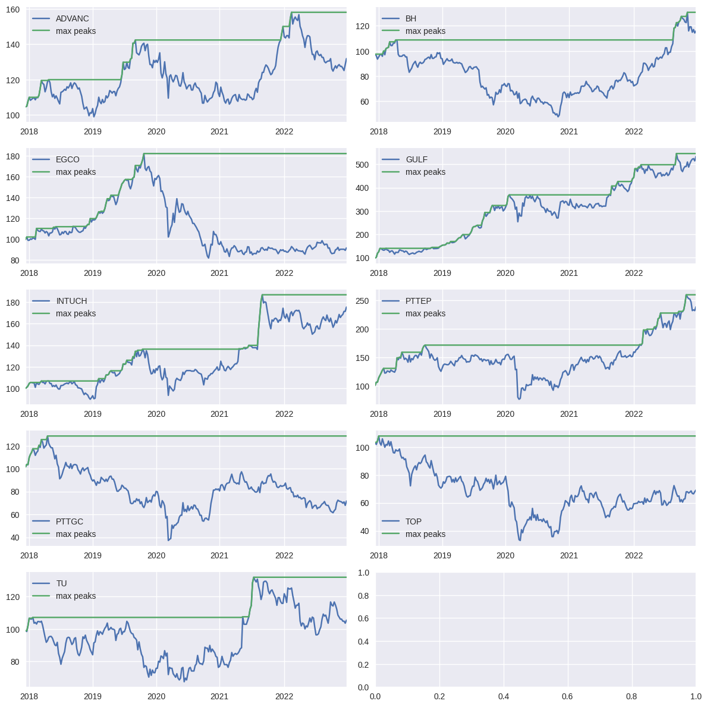
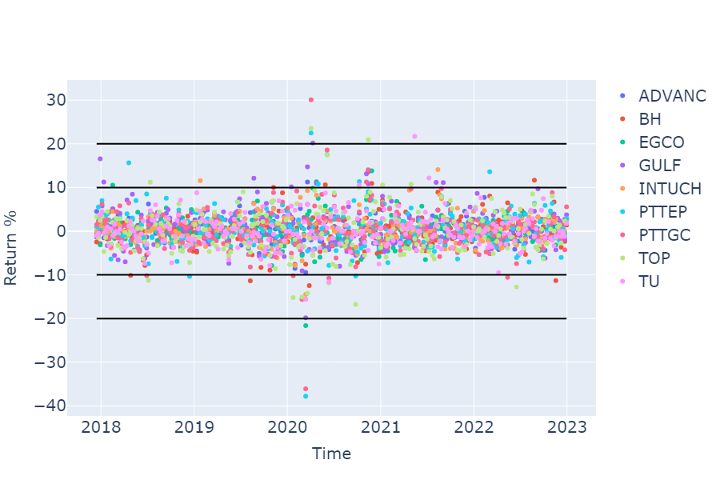

# Visualizing-Data-A-Journey-Through-Insights-with-Python-2
 This project is dedicated to the art and science of data visualization using Python. In a world driven by data, effective visualization is the bridge between raw information and actionable insights. Through this project, I aim to showcase how complex datasets can be transformed into compelling, interactive, and insightful visual stories.

 ## 📄 Guide
Download the PDF here: [Visualizing Data Guide](docs/docs/docs/Visualizing.pdf)

## 🗂️ Code Examples
### 1. **Normalized Trends Over Time** 
**When to use**: Compare trends of multiple variables (e.g., temperature, sales, user activity) by normalizing their starting values to 1.0.  
**Example**:  
- Track relative growth of product sales across regions.  
- Compare temperature fluctuations in different cities. 

```python
# import pandas pd
import plotly.graph_objects as go

# Function to normalize prices
def normalizedprice(df):
    """
    Normalizes the prices in a DataFrame so they all start at 1.0.
    This makes it easier to compare trends over time.
    """
    normalized_df = df / df.iloc[0]  # Divide each value by the first row's value
    return normalized_df

# Example DataFrame (replace this with your actual data)
# df = pd.read_csv('data/stock_data.csv', index_col='Date', parse_dates=True)

# Normalize the prices
normalized_price = normalizedprice(df)

# Create a Plotly figure
fig = go.Figure()

# Add a line for each column in the normalized DataFrame
for col in normalized_price.columns:
    fig.add_trace(go.Scatter(
        x=normalized_price.index,  # X-axis: Dates
        y=normalized_price[col],   # Y-axis: Normalized prices
        name=col,                  # Name of the line (e.g., stock name)
        mode='lines'               # Draw a line chart
    ))

# Update the layout of the chart
fig.update_layout(
    title='Normalized Stock Prices Over Time',  # Chart title
    xaxis_title='Date',                         # X-axis label
    yaxis_title='Normalized Price',             # Y-axis label
    showlegend=True                             # Show the legend
)

# Save the chart as an image
fig.write_image("figures/normalized_prices.png")

# Display the chart
fig.show()

# Sort and display the normalized prices on a specific date
sorted_prices = normalized_price.loc["2022-09-30"].sort_values(ascending=False)
print("Normalized Prices on 2022-09-30 (Sorted):")
print(sorted_prices)

```

## 🗂️ Multi-Strategy Comparison Bar Chart


**When to use**: Compare how different strategies distribute resources (budget, time, personnel) across categories.  

**Examples**:
- **Business**: Compare marketing budget allocation across channels (social media, ads, events).  
- **Healthcare**: Visualize hospital staff distribution across departments.  
- **Education**: Analyze funding allocation for school programs.  
```python
# See code/import numpy as np
import matplotlib.pyplot as plt

# Example data (replace with your actual data)
weights_strategy1 = [0.15, 0.25, 0.10, 0.20, 0.30]  # e.g., "Min Cost" allocation
weights_strategy2 = [0.30, 0.20, 0.15, 0.25, 0.10]  # e.g., "Max Efficiency"
weights_strategy3 = [0.20, 0.20, 0.20, 0.20, 0.20]  # e.g., "Balanced"
categories = ['Group A', 'Group B', 'Group C', 'Group D', 'Group E']
n_categories = len(categories)

# Convert weights to percentages
strategy1 = 100 * np.array(weights_strategy1)
strategy2 = 100 * np.array(weights_strategy2)
strategy3 = 100 * np.array(weights_strategy3)

# Create the bar chart
X = np.arange(start=1, stop=n_categories + 1, step=1)
width = 0.25  # Width of each bar

plt.figure(figsize=(12, 6))

# Plot each strategy
plt.bar(X - width, strategy1, width=width, color='teal', label='Min Cost')
plt.bar(X, strategy2, width=width, color='darkorange', label='Max Efficiency')
plt.bar(X + width, strategy3, width=width, color='blue', label='Balanced')

# Add labels and title
plt.title('Resource Allocation Strategies Comparison')
plt.xlabel('Categories')
plt.ylabel('Allocation (%)')
plt.xticks(X, categories)
plt.legend()
plt.tight_layout()

# Save and display
plt.savefig("figures/allocation_comparison.png")
plt.show().py
```

## 🗂️ Max Drawdown Analysis

**When to use**: When to use: Analyze the maximum drawdown, which is the peak-to-trough decline during a specific recorded period of an investment, fund, or commodity. It is usually quoted as the percentage between the peak and the trough.

**Examples**:
- **Finance**: Assess the risk of investment portfolios. 
- **Engineering**: Evaluate the performance of systems under stress.
- **Healthcare**: Monitor patient health metrics over time.


```python
# See code/drawdimport matplotlib.pyplot as plt
import pandas as pd

# Example data (replace with your actual data)
# wealth_index = pd.DataFrame(...)
# previous_peaks = pd.DataFrame(...)

# Define the columns to plot
columns = ['ADVANC', 'BH', 'EGCO', 'GULF', 'INTUCH', 'PTTEP', 'PTTGC', 'TOP', 'TU']

# Create subplots
fig, ax = plt.subplots(figsize=(12, 12), nrows=5, ncols=2)
ax = ax.flatten()

# Loop through the columns and plot each one
for i, col in enumerate(columns):
    wealth_index[col].plot(grid=True, ax=ax[i], legend=True, label="Wealth Index")
    previous_peaks[col].plot(grid=True, ax=ax[i], legend=True, label="Max Peaks")

# Save the chart
plt.tight_layout()
plt.savefig("figures/max_drawdown.png")

# Display the chart
plt.show()own_plots.py
```

## 📊 Returns Analysis

**When to use**: This visualization helps in analyzing the percentage returns of various entities over time. It is useful for identifying trends and comparing performance across different entities.

**Examples**:
- **Finance**: Track the performance of different stocks or funds.
- **Engineering**: Monitor the efficiency of different systems.
- **Healthcare**: Observe changes in patient metrics.

```python
# See code/re# code/returns_analysis.py
import plotly.graph_objects as go
import pandas as pd

# Example data (replace with your actual data)
# Returns = pd.DataFrame(...)

# Create a Plotly figure
fig = go.Figure()

# Add scatter plots for each column in Returns
for col in Returns.columns:
    fig.add_trace(go.Scatter(x=Returns.index, y=Returns[col] * 100, name=col, mode='markers'))

# Define horizontal lines at +5%, +10%, +20%, and their negative counterparts
horizontal_lines = [10, 20, -10, -20]  # Y-values for the horizontal lines

for y in horizontal_lines:
    fig.add_shape(
        type="line",
        x0=Returns.index.min(),  # Start of the line (minimum x-axis value)
        x1=Returns.index.max(),  # End of the line (maximum x-axis value)
        y0=y,  # Y-coordinate for start of the line
        y1=y,  # Y-coordinate for end of the line (same as start for horizontal line)
        line=dict(
            color="black",  # Line color
            width=2,       # Line width
            dash="solid"    # Line style (e.g., "solid", "dot", "dash")
        )
    )

# Update layout for axis titles, legend, and size
fig.update_layout(
    title='Returns Analysis',  # Title of the plot
    xaxis=dict(
        title='Time',
        title_font=dict(size=20),
        tickfont=dict(size=20)
    ),
    yaxis=dict(
        title='Return %',
        title_font=dict(size=20),
        tickfont=dict(size=20)
    ),
    legend=dict(
        font=dict(size=20)
    ),
    showlegend=True,
    width=900,  # Set the width of the plot
    height=600  # Set the height of the plot
)

# Save the chart
fig.write_image("figures/returns_analysis.png")

# Display the chart
fig.show()turns_scatter.py
```

## 📊 Portfolio Weights Over Time

**When to use**: This visualization helps in analyzing the distribution of portfolio weights across different assets over time. It is useful for understanding how the allocation of assets changes and for comparing different investment strategies.

**Examples**:
- **Finance**: Track the allocation of assets in a portfolio.
- **Engineering**: Monitor resource allocation in projects.
- **Healthcare**: Observe the distribution of resources across different departments.


```python
# code/portfolio_weights.py
import matplotlib.pyplot as plt
import seaborn as sns
import pandas as pd

# Function to plot weights over time in the style of the image
def plot_stacked_bar(weights_df, strategy):
    plt.figure(figsize=(12, 8))

    # Access the DataFrame for the current strategy using weights_df[strategy]
    df = weights_df[strategy]

    # Normalize weights to 100% for better comparison (sum of weights for each row = 100)
    weights_normalized = df.div(df.sum(axis=1), axis=0) * 100

    # Use a predefined color palette, similar to the example image
    colors = sns.color_palette('Paired', n_colors=len(df.columns))  #Paired

    # Plot as stacked bar chart
    ax = plt.gca()
    bar_width = 1 # Adjust width of bars
    x = range(len(weights_normalized))

    # Stack bars manually to achieve overlap effect
    bottom = [0] * len(weights_normalized)
    for i, col in enumerate(weights_normalized.columns):
        ax.bar(x, weights_normalized[col], width=bar_width, color=colors[i], edgecolor='black', linewidth=1.2, bottom=bottom, label=col)
        bottom += weights_normalized[col]

    # Add labels and titles
    plt.title(f'{strategy}', fontsize=16)
    #plt.xlabel('Date', fontsize=16)
    plt.ylabel('Portfolio weight (%)', fontsize=18)
    plt.xticks(fontsize=18)  # Adjust as needed
    plt.yticks(fontsize=18)  # Adjust as needed

    # Format x-axis dates
    tick_frequency = 4 # added tick_frequency
    ax.set_xticks(range(0, len(df), tick_frequency))
    ax.set_xticklabels(df.index.strftime('%Y-%m-%d')[::tick_frequency], rotation=85)

    # Adjust legend
    plt.legend(loc='upper left', bbox_to_anchor=(.99,.99), title='', fontsize=18)

    # Clean layout and display
    plt.tight_layout()
    plt.savefig("figures/portfolio_weights.png")
    plt.show()

# Example data (replace with your actual data)
# weights_df = pd.DataFrame(...)
# strategies = ['Strategy1', 'Strategy2']  # Replace with your actual strategies

# Plot the stacked bar chart for each strategy
for strategy in strategies:
    plot_stacked_bar(weights_df, strategy)
